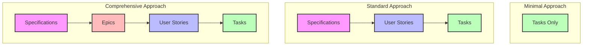

# Session 01 - Deciding on the Structure

## Directory Organization

When working with AI productivity tools, it's helpful to establish a consistent organization structure:

- **`.copilot/`** or **`.cursor/`** folder - Store tool-specific prompts and configurations
- **`.project/`** folder - Store all material for the AI tool to consume
  - Documentation
  - Specifications
  - User stories
  - Tasks

> **Tip:** Keeping AI-specific documents in version control makes them shareable with your team and ensures consistent results across different sessions.

## Determining Your Project Management Layers

Different projects require different levels of structure. Let's explore how to determine the optimal approach for your needs.

### Key Factors to Consider

1. **Project Complexity**
   - Simple projects may only need task-level planning
   - Complex projects benefit from a more detailed hierarchy

2. **Team Size**
   - Solo developers might use a simplified structure
   - Larger teams typically need more formalized layers

3. **Project Duration**
   - Short-term projects can use fewer layers
   - Long-term projects benefit from more detailed planning

4. **Domain Familiarity**
   - Familiar domains may need less structure
   - New domains benefit from more detailed planning

### Common Layer Structures



#### Minimal Approach: Tasks Only
```
.project/
└── tasks/
    ├── task_001.md
    ├── task_002.md
    └── ...
```

**Best for:** Small projects, solo developers, familiar domains

#### Standard Approach: User Stories → Tasks
```
.project/
├── specifications/
│   └── project_overview.md
├── user_stories/
│   ├── us_001.md
│   └── us_002.md
└── tasks/
    ├── us_001_task_001.md
    ├── us_001_task_002.md
    └── ...
```

**Best for:** Medium-sized projects, small teams, moderate complexity

#### Comprehensive Approach: Epics → User Stories → Tasks
```
.project/
├── specifications/
│   └── project_overview.md
├── epics/
│   ├── epic_001.md
│   └── epic_002.md
├── user_stories/
│   ├── epic_001_us_001.md
│   ├── epic_001_us_002.md
│   └── ...
└── tasks/
    ├── epic_001_us_001_task_001.md
    ├── epic_001_us_001_task_002.md
    └── ...
```

**Best for:** Large projects, multiple teams, complex domains

## Structuring Individual Items

### Project Specifications

**Purpose:** Provides context and background for the AI

**Recommended Structure:**
```markdown
# Project: [Project Name]

## Overview
[Brief description of the project]

## Current State
[Description of existing functionality or starting point]

## Goal State
[Description of desired end state]

## Technical Context
- Programming language: [Language]
- Framework: [Framework]
- Key libraries: [Libraries]
- Patterns to follow: [Patterns]

## Constraints
[Any limitations or requirements to follow]
```

### User Stories

**Purpose:** Describes features from a user perspective

**Recommended Structure:**
```markdown
# User Story: [US-ID]

## Title
[Brief descriptive title]

## Description
As a [type of user], I want [goal] so that [benefit].

## Acceptance Criteria
- [ ] [Criterion 1]
- [ ] [Criterion 2]
- [ ] [Criterion 3]

## Technical Notes
[Any implementation details or considerations]

## Related Stories
- [Related-US-ID-1]
- [Related-US-ID-2]
```

### Tasks

**Purpose:** Provides specific implementation details

**Recommended Structure:**
```markdown
# Task: [Task-ID]

## Title
[Brief descriptive title]

## Related User Story
[US-ID]

## Description
[Detailed description of what needs to be implemented]

## Steps
1. [Step 1]
2. [Step 2]
3. [Step 3]

## Acceptance Criteria
- [ ] [Criterion 1]
- [ ] [Criterion 2]
- [ ] [Criterion 3]

## Files to Modify
- [Filepath 1]
- [Filepath 2]

## Testing Approach
[How this task should be tested]
```

## Workshop Exercise

Let's apply what we've learned by creating an appropriate structure for our ASCII font renderer project.

1. Determine the appropriate number of layers for this project
2. Create a initial prompt `init.md`